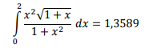
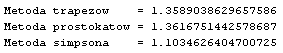

# PRiR Całkowanie i symulator
Przykład całki: <br>
<br>
Klasy reprezentujące metody całkowania:
```javascript
class Trapez extends Thread
class Simp extends Thread
class Prostokat extends Thread
```
Otrzymane wyniki: <br>
<br><br>
Symulator schroniska wyróżnia 4 stany:<br>
```javascript
static int otwarte = 1; //schronisko jest otwarte
static int zamkniete = 2; //dostawa zaopatrzenia
static int zaopatrzenie_na_wykonczeniu = 3; //schronisko się zamyka
static int warunki_ekstremalne = 4; //zdarzenie ekstremalne/katastrofa - wyjście z pętli
```
